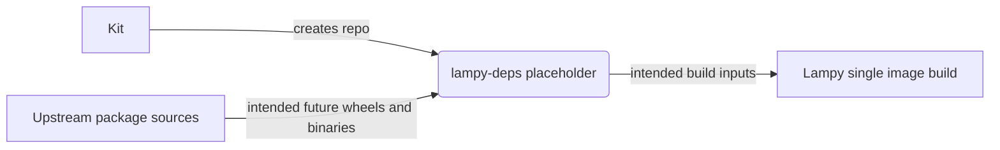
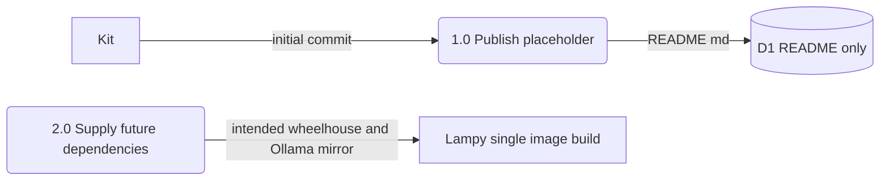

Living document — update these diagrams when adding features.

# lampy-deps — Architecture

lampy-deps is currently an empty placeholder repo. Its entire content is a single README.md stating its intended purpose: hold build dependencies for the Lampy forum stack — a Python wheelhouse and an Ollama distribution mirror. No wheels, no binaries, no scripts, and no commits beyond the initial one exist yet. There is no real data model.

## 1. Context diagram (level 0)

The "system" is a storage location that does not exist yet — shown honestly as the placeholder it is.

## 2. Level-1 data flow diagram

Minimal by design: the only observed artifact is the README. The two processes below are the repo's stated purpose, not implemented behavior.

## 3. Entity–relationship diagram

No persistent data model observed — the repo contains exactly one file, README.md, and zero data artifacts. There is nothing to model. Diagram omitted deliberately.

## Grounding notes

- OBSERVED: the full tree of the repo's HEAD is a single blob, `README.md` (109 bytes).
- OBSERVED: README.md body is exactly: "Build dependencies for the Lampy forum stack: Python wheelhouse and Ollama distribution mirror."
- OBSERVED: the repo's only commit is "Initial commit" dated 2026-09-27 — no dependency files have ever been added.
- OBSERVED (cross-repo): the lampy-single README says its Dockerfile expects `wheelhouse/` and `ollama-donor/` directories in the build context, and that they are NOT in the lampy-single repo — lampy-deps' stated purpose matches those two inputs by name and type.
- INFERRED: that lampy-deps is meant to be the source of those two directories for the lampy-single build. Strong inference, but not stated anywhere observed.
- INFERRED: everything about how dependencies would be staged, mirrored, or versioned — completely absent; deliberately not diagrammed.
