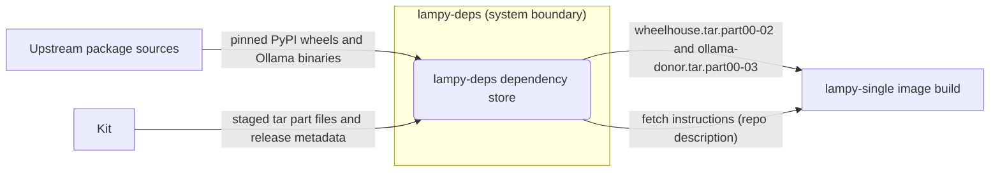
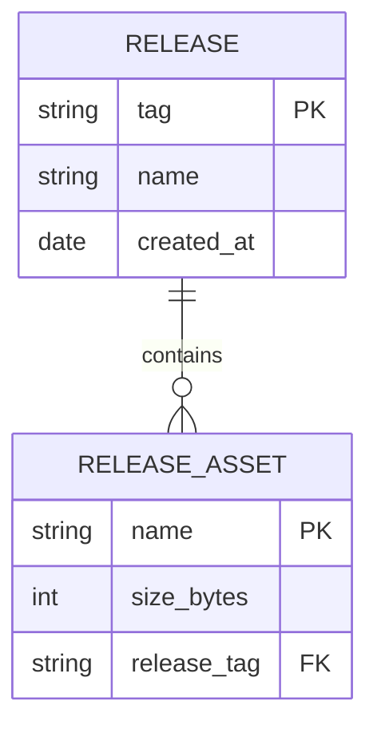

Living document — update these diagrams when adding features.

# lampy-deps — Architecture

lampy-deps is the build-dependency supply point for the Lampy single-image build. Its git tree holds only `README.md` and `docs/architecture.md` — but the repo is **not** empty where it counts: the actual dependency payloads live in the **`build-deps-v1` release** (created 2026-09-27): 7 split tar part files — 3 parts of `wheelhouse.tar` (Python wheelhouse, ~3.3 GB) and 4 parts of `ollama-donor.tar` (Ollama distribution mirror, ~5 GB). The repo description is the retrieval procedure: *"Get all .partNN files from the build-deps-v1 release, concatenate in order."* The tarballs expand to the `wheelhouse/` and `ollama-donor/` directories the lampy-single Dockerfile expects in its build context.

## 1. Context diagram (level 0)

## 2. Level-1 data flow diagram

```mermaid
flowchart LR
    E1["Kit"]
    E2["lampy-single image build"]
    E3["Upstream package sources"]
    P1("1.0 Stage dependency archives")
    P2("2.0 Publish release")
    P3("3.0 Serve release downloads")
    D1[("D1 Staged part files")]
    D2[("D2 build-deps-v1 release assets")]

    E3 -->|"pinned PyPI wheels"| P1
    E3 -->|"pinned Ollama image binaries"| P1
    E1 -->|"runs staging scripts"| P1
    P1 -->|"wheelhouse.tar.partNN and ollama-donor.tar.partNN"| D1
    D1 -->|"split tar part files"| P2
    E1 -->|"release tag and notes"| P2
    P2 -->|"build-deps-v1 with 7 assets"| D2
    E2 -->|"download request"| P3
    D2 -->|"release part files"| P3
    P3 -->|"wheelhouse.tar and ollama-donor.tar parts"| E2
```

## 3. Entity–relationship diagram

The repo's real data model is the release and its assets — the only persisted dependency records:

## Grounding notes

- OBSERVED: git HEAD tree (main) is exactly 3 entries: `README.md`, `docs/`, `docs/architecture.md`. No dependency files are committed to git.
- OBSERVED: release `build-deps-v1` ("Lampy build dependencies (wheelhouse + Ollama donor)", created 2026-09-27) holds 7 assets: `ollama-donor.tar.part00`–`part03` (1,572,864,000 bytes × 3 + 330,752,000 ≈ 4.7 GiB) and `wheelhouse.tar.part00`–`part02` (1,572,864,000 × 2 + 211,046,400 ≈ 3.1 GiB). The 1,572,864,000-byte part size is 1500 MiB.
- OBSERVED: repo description (via API): "Lampy build dependencies: Python wheelhouse (3.3GB, 3 parts) + Ollama distribution mirror (5GB, 4 parts). Get all .partNN files from the build-deps-v1 release, concatenate in order." — this is the retrieval procedure, stated verbatim.
- OBSERVED: README.md body is exactly 109 bytes — line 1 "# lampy-deps", line 2 "Build dependencies for the Lampy forum stack: Python wheelhouse and Ollama distribution mirror.", trailing newline.
- OBSERVED: 2 commits total — "Initial commit" (2026-09-27T11:45:17Z) and "docs: add SAD architecture doc (context diagram, level-1 DFD, ERD)" (2026-09-28T21:23:31Z).
- OBSERVED (cross-repo): the lampy-single README expects `wheelhouse/` (209 wheels: torch, pgai, flask, gunicorn, psycopg, etc.) and `ollama-donor/` (`/usr/bin/ollama`, `/usr/lib/ollama/`, `/usr/share/ollama/`) in the build context, explicitly NOT in the lampy-single repo; the lampy-single repo description says "Build deps in cosbykit-afk/lampy-deps."
- OBSERVED (cross-repo): `build-wheelhouse.sh` (in lampy-single) rebuilds the wheelhouse from PyPI via `pip download` (cp310, manylinux x86_64, pinned `wheelhouse-packages.txt`); `vendor-ollama.sh` re-extracts `ollama-donor/` byte-identical from pinned `ollama/ollama:latest@sha256:da6e0dc5651df159e45686fd663c4dbe1624a52c44d7280eeac1551d8f865532`.
- OBSERVED (local checkout only, not GitHub state): `~/workspace/lampy-deps` holds uncommitted staging artifacts (`ollama-donor.tar.part00`–`part03`, `wheelhouse.tar.part00`–`part02`, `chunks/`, `stage/`, `ollama-img`, `ollama-root`) — working material for the release, not part of the repo. GitHub is the source of truth for this doc.
- INFERRED: the release tarballs expand to exactly the `wheelhouse/` and `ollama-donor/` directories the lampy-single Dockerfile `COPY`s. Strong name/type match (tar names → dir names → Dockerfile paths), but the expansion step is stated nowhere observed.
- INFERRED: the direct E3→S0 flow in the context diagram — the wheels/binaries reached the release via Kit's staging scripts (observed in lampy-single), not by a direct upstream-to-repo transfer; the DFD's P1 shows the honest path.
